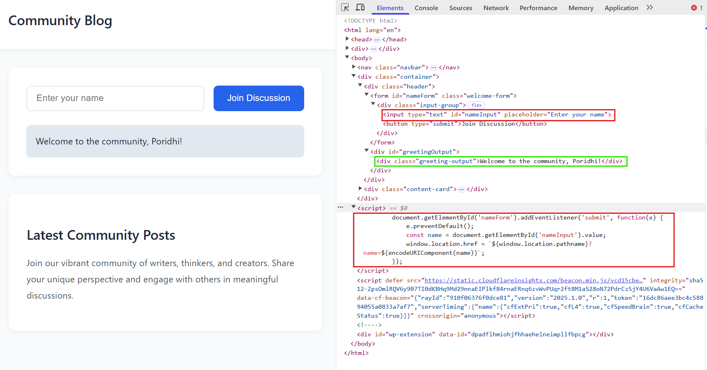
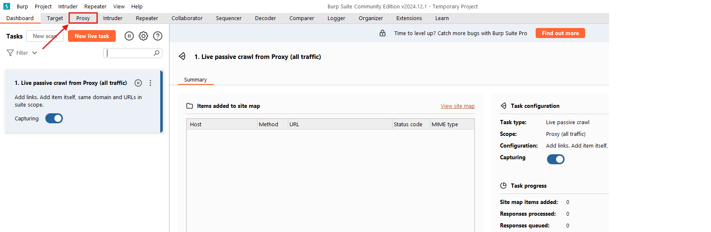

# **Bypassing HTML Encoding in AWS**

In Reflected XSS, a user's input is included in the response of a web application without proper sanitization. When an application is vulnerable to Reflected XSS, an attacker can exploit the application by injecting a malicious script in the input field. In this lab, we will simulate **Reflected XSS** in a vulnerable web application hosted in `AWS` and systematically **test all possible HTML tags** using **Burp Suite** to find an effective payload. By doing so, we will learn how attackers exploit such vulnerabilities and understand the importance of strong security measures.

## **Objective**  

The goal of this hands-on lab is to:  

- Understand Reflected XSS and how it works in a real-world scenario.  
- Explore how HTML encoding can be bypassed despite partial security measures.  
- Use Burp Suite to automate testing for different HTML tags to identify working exploits. 
- Deploy a vulnerable web application in AWS and test it for Reflected XSS.
- Analyze application responses to determine which tags and attributes are vulnerable.  
- Gain insight into the mitigation strategies that can effectively prevent these types of attacks. 

## **Prerequisites**

- AWS Infrastructure
- Terraform
- Docker
- `Burp Suite` installed in your system
- Basic knowledge of `HTML`, `CSS`, and `JavaScript`

## **Reflected XSS** 

Reflected XSS is a type of XSS attack where the malicious script is reflected off the web application back to the victim's browser. This type of XSS is common in web applications that handle user input, such as name fields, comment sections, and login forms.


An attacker crafts a malicious URL containing a script and tricks a user into clicking it. The vulnerable website reflects the script in its response without proper sanitization, causing the user's browser to execute it, leading to data theft or session hijacking.

## **Burp Suite**

Burp Suite is a leading tool for web application security testing. It offers a comprehensive suite of tools for:

- Intercepting and analyzing HTTP/HTTPS traffic.
- Detecting and exploiting web application vulnerabilities.
- Automating security testing workflows.

## **Why use Burp Suite to Bypass HTML Encoding?**

We have so many tags in HTML like `<script>`, ``, `<svg>`, `<a>`, etc. and each of them has so many attributes. When an developer builds a web application, he/she may not encode all the possible HTML tags and attributes. Attackers use Burp Suite to brute-force the HTML tags and find a working exploit.


For example, a developer forget the encode the `svg` tag, so an attacker can use the `svg` tag to execute the JavaScript code.

```html
<svg onload="alert('XSS')"></svg>
```

But in `HTML` we have more than 100 tags, for attackers it is very difficult to test all the tags and attributes. So, attackers use Burp Suite to brute-force the HTML tags and find a working exploit.

## **How Burp Suite Bypass HTML Encoding**  

Burp Suite is an advanced web security tool that can help identify vulnerabilities in web applications, including **bypassing HTML encoding protections**. One of its core features, **Intruder**, plays a crucial role in testing how a web server processes encoded HTML inputs and whether they can be exploited. 


### **Capturing and Modifying Requests**  
Burp Suite’s **Proxy** intercepts the request sent from the browser to the server, allowing an attacker to examine the structure of the request. If the request contains a user input field (such as a form or search bar), Burp Suite extracts and isolates the specific parameter where HTML encoding protections might be applied.  

### **Injecting Payloads via Intruder**  
Burp Suite’s **Intruder** automates the process of sending multiple variations of a payload to determine how the server handles different encoding schemes. It does this by:  

1. **Identifying Input Fields:** Intruder pinpoints parameters where user input is processed and attempts to manipulate them.  
2. **Replacing User Input with Payloads:** It substitutes normal user input with various HTML-encoded payloads such as:  
   - `<script>alert('XSS')</script>` (raw HTML)  
   - `&lt;script&gt;alert('XSS')&lt;/script&gt;` (HTML encoded) 
   - `&#x3C;script&#x3E;alert('XSS')&#x3C;/script&#x3E;` (Hex encoding)
   - `%3Cscript%3Ealert('XSS')%3C/script%3E` (URL encoding)

Intruder **systematically injects** these payloads into the selected parameter and sends them to the server to analyze the response.  

### **Analyzing Server Responses**  


Burp Suite **monitors the behavior** of the server when different encoded versions of the payload are received. It does this by:  

- **Comparing HTTP Response Codes:** If different encoding formats return different HTTP status codes (e.g., `200 OK` for successful execution, `403 Forbidden` for blocked input), it indicates how the server processes the input.  
- **Checking Content Reflection:** If the server returns the payload **without encoding it again**, it suggests a potential vulnerability where the input is rendered as raw HTML, leading to execution in the browser.  
- **Detecting Filtering Mechanisms:** If some payloads are blocked while others pass through, Intruder helps identify which encoding methods successfully bypass input sanitization.  

### **Finding Bypasses through Encoding Variations**  
Burp Suite **automates** the process of testing different encoding techniques. If one encoding method is blocked, it tries alternative formats until it finds a **working bypass**. This includes:  

1. **Double Encoding**: `%253Cscript%253Ealert('XSS')%253C/script%253E`  
2. **Mixed Encoding**: Using combinations of **hex, URL, and HTML encoding** to trick the filtering mechanism.  
3. **Character Injection**: Injecting broken sequences or null bytes (`%00`) to disrupt encoding routines.  

If a certain encoded version gets **executed instead of displayed as text**, Burp Suite flags it as a potential exploit.  

### **Extracting the Exploit**  
Once Burp Suite identifies a bypass, it refines the payload to **maximize impact** while avoiding detection. If an encoded version executes JavaScript or injects unwanted HTML elements, it confirms that the encoding protections are weak. The final exploit is then extracted and used for further testing or reporting the vulnerability.


## **Hands-on in AWS**
Now we will run a vulnerable `Application` in `AWS` and perform a `Reflected XSS for Bypassing HTML Encoding` using `Burp Suite`.

To Deploy the `Application` in `AWS` first we need to create the infrastructure. Including `AWS` `VPC`,`Subnet`,`Route Table`,`Internet Gateway`,`Key Pair`,`EC2 Instance`. Creating this infrastructure is lengthy process. So we will use `Terraform` to create the infrastructure.

**Terraform** is an open-source infrastructure as code tool that allows you to define and provision your cloud infrastructure in a declarative manner. It provides a high-level configuration language to describe your infrastructure in a way that is easy to understand and maintain.

## **Create the Infrastructure with `Terraform`**


### **Step 1: Configure aws credentials**

To get `AWS` Credententals open the lab landing page in right bottom corner in `Poridhi`, Click on Generate Credentails for `AWS`.


It will provide necessary credentials to access `AWS` services.

Copy the `Access Key ID` and `Secret Access Key`.

To Configure the `AWS` try the following command:

```bash
aws configure
```


Use the `Access Key ID` and `Secret Access Key` that was copied to configure the `AWS` credentials. For `region` type `ap-southeast-1` and format as `json`.

### **Step 2: Creating Key Pair**

```bash
mkdir aws-infra
cd aws-infra
```
Inside the project folder apply the following command to create the key file

```bash
aws ec2 create-key-pair --key-name my-key --query "KeyMaterial" --output text > my-key.pem
```

After running the command, a key file will be created in the project folder named `my-key.pem`.

Make the key file read only

```bash
chmod 400 my-key.pem
```

### **Step 3: Creating the `main.tf` file**

Create the `main.tf` file in the project folder with the following content:

```bash
provider "aws" {
  region = "ap-southeast-1"
}

# Create VPC
resource "aws_vpc" "my_vpc" {
  cidr_block           = "10.0.0.0/16"
  enable_dns_support   = true
  enable_dns_hostnames = true

  tags = {
    Name = "my-vpc"
  }
}

# Create Public Subnet
resource "aws_subnet" "public_subnet" {
  vpc_id                  = aws_vpc.my_vpc.id
  cidr_block              = "10.0.101.0/24"
  availability_zone       = "ap-southeast-1a"
  map_public_ip_on_launch = true  # Assign public IP automatically

  tags = {
    Name = "public-subnet"
  }
}

# Create Internet Gateway
resource "aws_internet_gateway" "igw" {
  vpc_id = aws_vpc.my_vpc.id

  tags = {
    Name = "my-internet-gateway"
  }
}

# Create Route Table for Public Subnet
resource "aws_route_table" "public_rt" {
  vpc_id = aws_vpc.my_vpc.id

  # Allow all traffic to the internet
  route {
    cidr_block = "0.0.0.0/0"
    gateway_id = aws_internet_gateway.igw.id
  }

  tags = {
    Name = "public-route-table"
  }
}

# Associate Route Table with Public Subnet
resource "aws_route_table_association" "public_association" {
  subnet_id      = aws_subnet.public_subnet.id
  route_table_id = aws_route_table.public_rt.id
}

# Create Security Group for EC2 Instance
resource "aws_security_group" "ec2_sg" {
  vpc_id = aws_vpc.my_vpc.id

  # Allow SSH (Port 22) from anywhere
  ingress {
    from_port   = 22
    to_port     = 22
    protocol    = "tcp"
    cidr_blocks = ["0.0.0.0/0"]
  }

  # Allow HTTP (Port 80) from anywhere
  ingress {
    from_port   = 80
    to_port     = 80
    protocol    = "tcp"
    cidr_blocks = ["0.0.0.0/0"]
  }

  # Allow HTTPS (Port 443) from anywhere
  ingress {
    from_port   = 443
    to_port     = 443
    protocol    = "tcp"
    cidr_blocks = ["0.0.0.0/0"]
  }

  # Allow Application Traffic (Port 8000)
  ingress {
    from_port   = 8000
    to_port     = 8000
    protocol    = "tcp"
    cidr_blocks = ["0.0.0.0/0"]  # Open to all (Modify for specific IPs)
  }

  # Allow all outbound traffic
  egress {
    from_port   = 0
    to_port     = 0
    protocol    = "-1"
    cidr_blocks = ["0.0.0.0/0"]
  }

  tags = {
    Name = "ec2-security-group"
  }
}

# Create EC2 Instance in Public Subnet
resource "aws_instance" "my_instance" {
  ami                    = "ami-0672fd5b9210aa093"
  instance_type          = "t2.micro"
  subnet_id              = aws_subnet.public_subnet.id
  vpc_security_group_ids = [aws_security_group.ec2_sg.id]
  
  associate_public_ip_address = true  # Assign Public IP
  key_name                    = "my-key"  # Use the key pair

  tags = {
    Name = "my-public-ec2"
  }
}

# Output the Public IP of the EC2 instance
output "ec2_public_ip" {
  description = "The public IP of the EC2 instance"
  value       = aws_instance.my_instance.public_ip
}
```

This state file will create the infrastructure and output the public IP of the EC2 instance. Here we have created a `VPC`, `Subnet`, `Internet Gateway`, `Route Table`, `Security Group` and `EC2 Instance`.

### **Step 4: Apply the Terraform State File**

```bash
terraform init
```

This command will initialize the terraform project.

```bash
terraform apply
```

This command will apply the state file and create the infrastructure. While applying the state file, it will ask for `yes` to apply the changes.

After the state file is applied, it will output the public IP of the EC2 instance.

### **Step 5: SSH into the EC2 Instance**

Get the public IP of the EC2 instance from the output of the `terraform output` command.

```bash
terraform output
```


copy the `Public IP` of the `ec2 instance`.

now using the public ip `ssh` into the `ec2-instance`

```bash
ssh -i my-key.pem ubuntu@<public-ip>
```
If you ssh for first time, it will ask for `yes` to continue.

Now you are successfully ssh into the `ec2-instance`.


### **Step 6: Install Docker on the EC2 Instance**

Inside the `ec2-instance` create a `install.sh` script for installing `docker`

```bash
nano install.sh
```
Now paste the following script

```bash
#!/bin/bash
sudo apt update -y && sudo apt upgrade -y
# Install dependencies
sudo apt install -y apt-transport-https ca-certificates curl software-properties-common
# Add Docker’s GPG key and repository
curl -fsSL https://download.docker.com/linux/ubuntu/gpg | sudo gpg --dearmor -o /usr/share/keyrings/docker-archive-keyring.gpg
echo "deb [arch=amd64 signed-by=/usr/share/keyrings/docker-archive-keyring.gpg] https://download.docker.com/linux/ubuntu $(lsb_release -cs) stable" | sudo tee /etc/apt/sources.list.d/docker.list > /dev/null
# Update package list and install Docker
sudo apt update -y && sudo apt install -y docker-ce
sudo systemctl start docker && sudo systemctl enable docker
sudo usermod -aG docker $USER
newgrp docker
```

To save the script and exit the nano editor, press `Ctrl + O` ,`Enter` and `Ctrl + X`.

Now make the script executable

```bash
chmod +x install.sh
```

Now run the script

```bash
./install.sh
```

Now you have successfully installed `docker` on the `ec2-instance`.

You can verify the docker installation by running the following command

```bash
docker --version
```


## **Run the Application in Docker in AWS EC2 Instance**

### **Step 1: Pull the Application from Docker Hub**

```bash
docker pull fazlulkarim105925/reflectedxss-with-most-tags-blocked
```

### **Step 2: Run the Docker Container**

```bash
docker run -d -p 8000:8000 fazlulkarim105925/reflectedxss-with-most-tags-blocked
```

### **Step 3: Check the Container Status**

By using the following command you can check the status of the container

```bash
docker ps
```


### **Step 4: Access the Application**

Now you can access the application by going to the `http://<aws-ec2-public-ip>:8000` in the browser.


In the `name` field, try to inter you name (e.g., `Poridhi`) and see how it reflected in the response.


If we open the `DevTools` of the browser, we can see that the application rendered the `name` field a Greeter message. It takes the `name` parameter and renders it as a Greeter message.



It also take the `name` parameter and render it in the `URL` as a parameter.


Now try to inter the `name` parameter as a `script` tag. for example:

```html
http://<aws-ec2-public-ip>:8000/?name=<script>alert(1)</script>
```


We can see that the application is blocked the `script` tag.

Now try with simple `<div>` tag.

```html
http://<aws-ec2-public-ip>:8000/?name=<div>test</div>
```


We can see that the application blocked the `<div>` tag also.

It suggested that the application blocked most of the HTML tags. But we need to find a `tag` which is not blocked by the application. We need to brute-force the HTML tags and find a working exploit. So we will use Burp Suite to brute-force the HTML tags and find a working exploit.

### **Step 5: Configure Burp Suite**

If Burp Suite is not installed in your system, you can download it from [here](https://portswigger.net/burp/communitydownload).


Download and installed Burp Suite.

Open `Burp Suite` and open a temporary project.

Navigate to `Proxy` tab in `Burp Suite`.



Make sure that the `Intercept is on` option is enabled. And launch the `Browser`.


A `Chromium` browser will be opened. In the browser, navigate to the application url with the `name` parameter as `<a>`.

```bash
http://<aws-ec2-public-ip>:8000/?name=<a>
```


As `Burp Suite` `Intercept` is enabled, it will intercept the request and we can see the request in `Burp Suite` `Proxy` tab.


Now we need to intercept the request and send it to `Intruder`. To do this, we need to right click on the request and select `Send to Intruder`.


Now we need to configure the `Intruder` tab in `Burp Suite`. Navigate to `Intruder` tab. We will see the `Target` `url` and intercepted request.


In the first line, we have the `Target` `url` and intercepted request.

```bash
GET /?name=%3Ca%3E HTTP/1.1
```
`%3C` and `%3E` are the encoded `<` and `>` characters. Between these characters, we have the `name` parameter (e.g., `<a>`).

Now select the `name` parameter (e.g., `a` only) and right click and select `Add payload position`.


`$` symbol is used to inject the payload. After adding the payload position, we will see the following.
```bash
GET /?name=%3C$a$%3E HTTP/1.1
```


Now we need the list of all the HTML tags. Postswigger has a cheat sheet for the HTML tags. We can use it to get the list of all the HTML tags. To get the cheat sheet, follow the `url` below. Copy all the `HTML` tags from the website.

```bash
https://portswigger.net/web-security/cross-site-scripting/cheat-sheet
```


Now paste the list of `HTML` tags in the `Intruder` `Payloads` tab.


Now we are all set to `start the attack`. Click on the `Start attack` button on the top right corner. A new `window` will be opened. Here we can see the `payload` that was injected in the `name` parameter and corresponding `response`  and other details.

To find the only `working` payload, we need to find the payload which is not blocked by the application. We can do this by checking the `status code` of the response. If the status code is `200`, then the payload is working. To sort the payloads by the `status code`, we need to click on the `status code` column. 


We have successfully found the `working` `HTML` tag. Now we can use this tag to exploit the application.

### **Step 6: Exploit the application**

Now we need to exploit the application. We will use the `working` `HTML` tag to exploit the application.

From `Burp Suite` `Intruder` tab, we have found the following `working` `HTML` tag.

```bash
<details>
<input>
<marquee>
```

We need to generate some payloads with this tags to exploit the application.

If you use the following payload in the `name` parameter, you will see that the tag is working, `Latest Community Posts` section is moving right to left.

```bash
name=<marquee>
```


We can also try out this payload in the `name` parameter. It will open an `alert` box with a message `1`.

```bash
name=<details ontoggle=alert(1) open>
```

Congratulations! You have successfully exploited the application. Find the `vulnerable` `endpoint` of the application and exploit it with the `working` `HTML` tag.


## **How to prevent XSS Attacks?**

To prevent XSS attacks, web developers should:    
- Try to encode all the `HTML` tags and attributes. use tools like `Burp Suite` to find the `vulnerable` `endpoints` and `HTML` tags and improve the security of the application.
- Implement **proper encoding** for **all** user input.
- Use **secure JavaScript APIs** like `textContent` instead of `innerHTML`.  
- Enforce **strict Content Security Policies (CSPs)** to restrict script execution.

## **Conclusion**  

In this lab, we have learned how to exploit the application using `Burp Suite`. We have also learned how to prevent XSS attacks. We have used the `Burp Suite` to find the `vulnerable` `endpoints` and `HTML` tags and improve the security of the application.